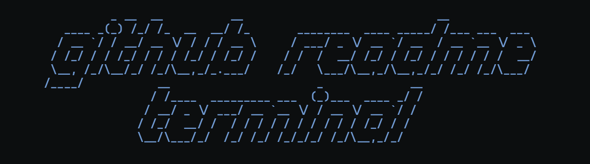

<p align="center">
    
    <br>
    <b>✨ Elevate your GitHub Profile ReadMe with Minimalistic Retro Terminal GIFs 🚀</b>
</p>

<h1 align="center">💻 GitHub ReadME Terminal 🎞️</h1>

<p align="center">
  <a href="https://github.com/astral-sh/ruff"></a>
  <a href="https://github.com/psf/black"></a>
  
  
  <a href="https://pypi.org/project/github-readme-terminal/"></a>
  
</p>

<p align="center">
  <a href="#-description">Description</a> •
  <a href="#-showcase">Showcase</a> •
  <a href="#-key-features">Features</a> •
  <a href="#%EF%B8%8F-prerequisites">Prerequisites</a> •
  <a href="#-installation">Installation</a> •
  <a href="#-quick-start">Quick Start</a> •
  <a href="#-api-reference">API</a> •
  <a href="#%EF%B8%8F-configuration">Configuration</a> •
  <a href="#-contributing">Contributing</a>
</p>

---

## 📘 Description

**github-readme-terminal** (package name: `gifos`) is a Python library that lets you programmatically simulate a retro PC booting into a \*nix terminal, typing commands, printing colored output, and finally rendering the whole sequence as an animated GIF — perfect for embedding in your GitHub Profile ReadME.

Instead of a static stats card, you get a living terminal that:

1. "Boots up" into a retro terminal window,
2. "Types" shell commands (`neofetch`, `fastfetch`, `cat about.txt`, …),
3. Prints your **live GitHub statistics** with full **ANSI color** support,
4. Encodes every frame into a looping **GIF** (via FFmpeg),
5. Optionally uploads the result to **ImgBB** so you can hot-link it in your README.

Your profile README becomes your canvas, and `gifos` is your paintbrush.

## 📸 Showcase

<picture>
    <source media="(prefers-color-scheme: dark)" srcset="docs/assets/sample.gif">
    <source media="(prefers-color-scheme: light)" srcset="docs/assets/sample.gif">
    
</picture>

## 🗝️ Key Features

- 👾 **Retro Vibes** — Simulate a retro PC booting into a \*nix terminal and running `neofetch`-style output to display details about your GitHub activity.
- 🖼️ **Unleash Your Creativity** — Full low-level control over rows, columns, frames, cursor position, fonts and colors. No rigid templates.
- 📈 **Live GitHub Stats** — Built-in helper functions that pull fresh profile stats (commits, stars, PRs, issues, reviews, followers, languages, rank) from the GitHub GraphQL/REST APIs.
- 🎨 **11 Color Schemes + ANSI Support** — Popular themes out of the box, plus complete support for ANSI-256 color escape sequences (`\x1b[38;5;NNNm`).
- 🛠️ **TOML-based Configuration** — Simple, organized configuration in `~/.config/gifos/`, overridable by environment variables.
- ⌨️ **Text Animations** — Built-in *typing*, *decode*, and *scramble* effects for dramatic reveals.
- 🖼️ **Image Pasting** — Paste (and scale) any image directly into the terminal canvas — logos, QR codes, avatars.
- 📦 **High-level Constructs** — `gen_text()`, `gen_typing_text()`, `gen_prompt()`, `scroll_up()`, `delete_row()`, `paste_image()` … compose complex sequences in a few lines.

## 🎯 Motivation

- 🌈 **Customization** is at the heart of the project — no more settling for pre-defined templates. Tailor your GitHub Profile ReadME to reflect your personality.
- 🌐 Unlike other GitHub user-statistic generators (which emit a single static card), this project offers a **fresh, narrative approach** to showcasing your profile information.
- 🚨 Stand out in the developer community with **visually appealing** GIFs that make a lasting impression.
- 📦 **High-level constructs** for simulating terminal operations provide unparalleled control over your ReadME aesthetic.

## ⚙️ Prerequisites

| # | Requirement | Version / Notes | Required? |
|---|-------------|-----------------|-----------|
| 1 | [Python](https://www.python.org/downloads/) | `>= 3.9` | ✅ Yes |
| 2 | [FFmpeg](https://ffmpeg.org/download.html) | Any recent build, must be on your `PATH` | ✅ Yes (for `gen_gif()`) |
| 3 | [GitHub personal access token](https://docs.github.com/en/authentication/keeping-your-account-and-data-secure/managing-your-personal-access-tokens#creating-a-fine-grained-personal-access-token) | Fine-grained, *Contents: Read-only* | ⬜ Optional (for GitHub stats) |
| 4 | [ImgBB API key](https://api.imgbb.com/) | Free tier available | ⬜ Optional (for hosting the GIF) |

Verify FFmpeg is available:

```bash
ffmpeg -version
```

## 📦 Installation

### From PyPI

```bash
python -m pip install --upgrade github-readme-terminal
```

### From source (this repository)

Using **pip**:

```bash
git clone https://github.com/<your-username>/github-readme-terminal.git
cd github-readme-terminal
python -m pip install --upgrade .
```

Using **Poetry** (the project's native toolchain):

```bash
git clone https://github.com/<your-username>/github-readme-terminal.git
cd github-readme-terminal
poetry install
poetry shell
```

> [!NOTE]
> The package bundles only the [gohufont-uni-14](https://github.com/hchargois/gohufont) bitmap font (`gifos/fonts/`). Bring your own fonts if you need additional ones, and refer to the [Pillow `ImageFont` documentation](https://pillow.readthedocs.io/en/stable/reference/ImageFont.html#module-PIL.ImageFont) when working with bitmap fonts.

## 🚀 Quick Start

```python
import gifos

# 1. Create a terminal canvas (320x240 px, 5 px padding)
t = gifos.Terminal(width=320, height=240, xpad=5, ypad=5)

# 2. Print some text (ANSI escape sequences are fully supported)
t.gen_text(text="Hello World!", row_num=1)
t.gen_text(text="With \x1b[32mANSI\x1b[0m escape sequence support!", row_num=2)

# 3. Pull live GitHub stats (needs GITHUB_TOKEN in .env or the environment)
github_stats = gifos.utils.fetch_github_stats(user_name="x0rzavi")

# 4. Overwrite row 1 with the fetched data
t.delete_row(row_num=1)
t.gen_text(text=f"GitHub Name: {github_stats.account_name}", row_num=1, contin=True)

# 5. Encode all frames into output.gif
t.gen_gif()

# 6. (Optional) Upload to ImgBB and get a shareable URL (needs IMGBB_API_KEY)
image = gifos.utils.upload_imgbb(file_name="output.gif", expiration=60)
print(image.url)
```

For a full, advanced implementation, see [`x0rzavi/x0rzavi`](https://github.com/x0rzavi/x0rzavi) — the author's own profile README generated with this library.

## 📖 API Reference

### `gifos.Terminal(width, height, xpad, ypad, font_file=..., font_size=16, line_spacing=4)`

Creates a terminal canvas. `font_file` defaults to the bundled `gohufont-uni-14.pil`; bitmap fonts ignore `font_size`.

| Parameter | Type | Default | Description |
|-----------|------|---------|-------------|
| `width` | `int` | — | Canvas width in pixels |
| `height` | `int` | — | Canvas height in pixels |
| `xpad` | `int` | — | Horizontal padding in pixels |
| `ypad` | `int` | — | Vertical padding in pixels |
| `font_file` | `str` | `gifos/fonts/gohufont-uni-14.pil` | Path to a `.pil`/`.pbm` bitmap font or a `.ttf`/`.otf` TrueType font |
| `font_size` | `int` | `16` | Font size (TrueType fonts only) |
| `line_spacing` | `int` | `4` | Vertical gap between rows, in pixels |

#### Rendering & output

| Method | Signature | Description |
|--------|-----------|-------------|
| `gen_text` | `(text: str \| list, row_num: int, col_num: int = 1, count: int = 1, prompt: bool = False, contin: bool = False)` | Draw text at a grid cell. Supports multi-line strings / lists of strings. `contin=True` continues from the current cursor column instead of jumping to `col_num`. |
| `gen_typing_text` | `(text: str, row_num: int, col_num: int = 1, contin: bool = False, speed: int = 0)` | Animate the text being typed character-by-character (each keypress becomes one or more frames). |
| `gen_prompt` | `(row_num: int, col_num: int = 1, count: int = 1)` | Render the configured shell prompt at a cell (holds the frame first so the prompt is visible). |
| `set_prompt` | `(prompt: str)` | Set the shell prompt string (e.g. `"visitor@github:~$ "`). |
| `paste_image` | `(image_file: str, row_num: int, col_num: int = 1, size_multiplier: float = 1)` | Paste an image at a cell, optionally rescaled while preserving aspect ratio. |
| `save_frame` | `(base_file_name: str)` | Save the current frame as a PNG (useful for debugging). |
| `gen_gif` | `()` | Encode every frame into `{output_gif_name}.gif` using FFmpeg (palettegen/paletteuse for high-quality color). |
| `set_fps` | `(fps: float)` | Set the GIF frame rate (overrides `general.fps` from config). |
| `set_loop_count` | `(loop_count: int)` | `-1` = play once, `0` = loop forever, `1..65535` = loop n times. |

#### Cursor & frame control

| Method | Signature | Description |
|--------|-----------|-------------|
| `cursor_to_box` | `(row_num, col_num, text_num_lines=1, text_num_chars=1, contin=False, force_col=False)` | Move the cursor to a grid cell; returns its pixel bounding box `(x1, y1, x2, y2)`. |
| `delete_row` | `(row_num: int, col_num: int = 1)` | Erase from a cell to the end of the row (reflowing the rest of the row). |
| `scroll_up` | `(count: int = 1)` | Scroll the whole canvas up by `count` rows, freeing the bottom row. |
| `clear_frame` | `()` | Wipe the canvas back to the background color. |
| `clone_frame` | `(count: int = 1)` | Repeat the current frame `count` times — the easiest way to add a *pause* in the animation. |
| `toggle_show_cursor` | `(choice: bool = None)` | Show/hide the cursor (`None` toggles). |
| `toggle_blink_cursor` | `(choice: bool = None)` | Enable/disable cursor blinking (`None` toggles). |

#### Styling

| Method | Signature | Description |
|--------|-----------|-------------|
| `set_txt_color` | `(txt_color: str = <default>)` | Set the default foreground color. |
| `set_bg_color` | `(bg_color: str = <default>)` | Set the canvas background color. |
| `set_font` | `(font_file: str, font_size: int = 16, line_spacing: int = 4)` | Swap the font at runtime (recomputes rows/columns). |

> Colors can also be set inline with ANSI escapes: `"\x1b[31mred\x1b[0m"`, `"\x1b[38;5;208m256-color\x1b[0m"`, `"\x1b[1;4mbold underline\x1b[0m"`.

### `gifos.utils`

| Function | Signature | Returns | Notes |
|----------|-----------|---------|-------|
| `fetch_github_stats` | `(user_name: str, ignore_repos: list = None, include_all_commits: bool = False)` | `GithubUserStats` | Aggregated profile stats: name, account name, total stars, commits, PRs, issues, reviews, followers, popular languages, rank, join date, etc. Requires `GITHUB_TOKEN`. |
| `fetch_user_stats` | `(user_name: str)` | `dict` | Raw GraphQL user node. *(`from gifos.utils.fetch_github_stats import fetch_user_stats`)* |
| `fetch_repo_stats` | `(user_name: str, repo_end_cursor: str = None)` | `dict` | Raw paginated repository stats. *(same import path)* |
| `fetch_total_commits` | `(user_name: str)` | `int` | Lifetime commit count via the REST API. *(same import path)* |
| `calc_github_rank` | `(all_commits, commits, prs, issues, reviews, stars, followers)` | `GithubUserRank` | Percentile rank using exponential/log-normal CDFs (same logic family as *github-readme-stats*). |
| `calc_age` | `(day: int, month: int, year: int)` | `UserAge` | Age breakdown from a join date. |
| `upload_imgbb` | `(file_name: str, expiration: int = None)` | `ImgbbImage` | Base64-uploads the file to ImgBB; returns `.url`, `.display_url`, … Requires `IMGBB_API_KEY`. |

### `gifos.effects`

| Function | Signature | Description |
|----------|-----------|-------------|
| `text_decode_effect_lines` | `(input_text: str, multiplier: int) -> list` | Generates frames where random characters flicker away to reveal the text (matrix-style decode). |
| `text_scramble_effect_lines` | `(input_text: str, multiplier: int, only_upper: bool = False, include_special: bool = True) -> list` | Generates frames where characters scramble before settling on the final text. |
| `generate_pattern_lines` | `(output_text_len: int, num_chars: int, count: int) -> list` | Generates decorative filler lines from `< > / *` characters. |

Example — reveal a line with the decode effect:

```python
import gifos
from gifos.effects import text_decode_effect_lines

t = gifos.Terminal(width=480, height=160, xpad=6, ypad=6)
for line in text_decode_effect_lines(input_text="booting gifos...", multiplier=3):
    t.delete_row(row_num=1)
    t.gen_text(text=line, row_num=1, contin=True)
t.clone_frame(count=10)          # hold the final frame
t.gen_gif()
```

## 🛠️ Configuration

Tunable options live in two places, with **environment variables taking precedence over TOML files**:

1. TOML files in `~/.config/gifos/` (created from the defaults shipped in `gifos/config/` on first run).
2. Environment variables (or a `.env` file next to your script).

### 📑 `gifos_settings.toml`

```toml
# ~/.config/gifos/gifos_settings.toml

[general]
debug = false          # draws row/column debug guides on frames
cursor = "_"           # the cursor glyph
show_cursor = true
blink_cursor = true
user_name = "x0rzavi"  # used by set_prompt()
fps = 15               # frames per second of the output GIF
color_scheme = "yoru"  # active theme from ansi_escape_colors.toml
loop_count = 0         # 0 = infinite loop, -1 = play once

[files]
frame_base_name = "frame_"
frame_folder_name = "frames"   # scratch dir for PNG frames (safe to delete)
output_gif_name = "output"     # produces output.gif
```

### 📑 `ansi_escape_colors.toml`

```toml
# ~/.config/gifos/ansi_escape_colors.toml

[yoru]
        [yoru.default_colors]
        fg = "#edeff0"
        bg = "#0c0e0f"

        [yoru.normal_colors]
        black = "#232526"
        red = "#df5b61"
        green = "#78b892"
        yellow = "#de8f78"
        blue = "#6791c9"
        magenta = "#bc83e3"
        cyan = "#67afc1"
        white = "#e4e6e7"

        [yoru.bright_colors]
        black = "#2c2e2f"
        red = "#e8646a"
        green = "#81c19b"
        yellow = "#e79881"
        blue = "#709ad2"
        magenta = "#c58cec"
        cyan = "#70b8ca"
        white = "#f2f4f5"
```

### 📑 Environment variables

Every TOML key maps to an env var following the pattern `GIFOS_<SECTION>_<KEY>`, upper-cased:

```bash
export GIFOS_GENERAL_DEBUG=true
export GIFOS_GENERAL_COLOR_SCHEME="catppuccin-mocha"
export GIFOS_CATPPUCCIN-MOCHA_DEFAULT_COLORS_FG="white"
export GIFOS_CATPPUCCIN-MOCHA_DEFAULT_COLORS_BG="black"
# Other variables are named similarly
```

### 📂 Optional API keys

Optional API keys must be present in a `.env` file (loaded automatically via `python-dotenv`) or exported as environment variables:

| Variable | Where to get it | Suggested scope |
|----------|-----------------|-----------------|
| `GITHUB_TOKEN` | [GitHub → Settings → Developer settings](https://docs.github.com/en/authentication/keeping-your-account-and-data-secure/managing-your-personal-access-tokens#creating-a-fine-grained-personal-access-token) | All repositories · Contents: **Read-only** |
| `IMGBB_API_KEY` | [api.imgbb.com](https://api.imgbb.com/) | — |

> [!WARNING]
> Never commit your `.env` file. It is already listed in `.gitignore`.

### 🌈 Color schemes included

| Scheme | Origin |
|--------|--------|
| `yoru` *(default)* | [rxyhn/yoru](https://github.com/rxyhn/yoru#art--colorscheme) |
| `gruvbox-dark` | [morhetz/gruvbox](https://github.com/morhetz/gruvbox) |
| `gruvbox-light` | [morhetz/gruvbox](https://github.com/morhetz/gruvbox) |
| `rose-pine` | [rosepinetheme.com](https://rosepinetheme.com/) |
| `dracula` | [draculatheme.com](https://draculatheme.com/) |
| `nord` | [nordtheme.com](https://www.nordtheme.com/) |
| `catppuccin-mocha` | [catppuccin/catppuccin](https://github.com/catppuccin/catppuccin) |
| `catppuccin-latte` | [catppuccin/catppuccin](https://github.com/catppuccin/catppuccin) |
| `onedark` | [navarasu/onedark.nvim](https://github.com/navarasu/onedark.nvim) |
| `monokai` | [monokai.pro](https://monokai.pro/) |
| `everblush` | [Everblush](https://github.com/Everblush) |

Add your own by appending a new top-level table to `ansi_escape_colors.toml` — no code changes required.

## 🗂️ Project Structure

```
github-readme-terminal/
├── gifos/
│   ├── gifos.py                  # Terminal class (canvas, cursor, frames, GIF export)
│   ├── __init__.py               # exposes Terminal + utils
│   ├── config/
│   │   ├── gifos_settings.toml   # default general/files settings
│   │   └── ansi_escape_colors.toml  # 11 color schemes
│   ├── effects/
│   │   ├── text_decode_effect.py    # matrix-style decode animation
│   │   └── text_scramble_effect.py  # scramble animation
│   ├── fonts/
│   │   ├── gohufont-uni-14.pil      # bundled bitmap font
│   │   └── gohufont-uni-14.pbm
│   └── utils/
│       ├── fetch_github_stats.py    # GraphQL/REST GitHub queries
│       ├── calc_github_rank.py      # percentile ranking
│       ├── calc_age.py
│       ├── convert_ansi_escape.py   # ANSI code → RGB resolution
│       ├── load_config.py           # TOML + env var loading
│       ├── upload_imgbb.py
│       └── schemas/                 # typed result objects
├── docs/assets/                 # logo + demo GIF
├── pyproject.toml               # Poetry packaging metadata
├── poetry.lock
├── .gitignore
├── CONTRIBUTING.md
├── CODE_OF_CONDUCT.md
└── LICENSE
```

### How it works

```
TOML/env config ─┐
                 ├─► Terminal canvas (Pillow) ──► frames/*.png ──► FFmpeg palette ──► output.gif ──► (optional) ImgBB
GitHub API ──────┘         ▲
                           │ gen_text / gen_typing_text / paste_image / scroll_up ...
```

Each high-level call draws onto the current Pillow frame; `clone_frame()` duplicates it to create pauses, and `gen_gif()` pipes the numbered PNG sequence through FFmpeg's `palettegen` + `paletteuse` filters for clean, banding-free GIF colors.

## 🤖 Keeping your README GIF fresh (CI example)

Regenerate the GIF on every push with GitHub Actions and commit it back:

```yaml
# .github/workflows/update-readme-gif.yml
name: Update README GIF
on:
  schedule:
    - cron: "0 0 * * *"   # daily
  workflow_dispatch:

jobs:
  regenerate:
    runs-on: ubuntu-latest
    steps:
      - uses: actions/checkout@v4
      - uses: actions/setup-python@v5
        with:
          python-version: "3.11"
      - name: Install FFmpeg
        run: sudo apt-get update && sudo apt-get install -y ffmpeg
      - name: Install package
        run: python -m pip install .
      - name: Generate GIF
        env:
          GITHUB_TOKEN: ${{ secrets.GITHUB_TOKEN }}
          IMGBB_API_KEY: ${{ secrets.IMGBB_API_KEY }}
        run: python generate.py
      - name: Commit
        run: |
          git config user.name "github-actions[bot]"
          git config user.email "github-actions[bot]@users.noreply.github.com"
          git add -A
          git diff --cached --quiet || git commit -m "chore: refresh README GIF"
          git push
```

## 🧰 Troubleshooting

| Symptom | Likely cause | Fix |
|---------|--------------|-----|
| `ffmpeg: command not found` / no `output.gif` | FFmpeg missing or not on `PATH` | Install from [ffmpeg.org](https://ffmpeg.org/download.html) and restart your shell |
| `KeyError: 'GITHUB_TOKEN'` / stats are `None` | Token missing | Add `GITHUB_TOKEN=ghp_...` to `.env` or export it in your shell |
| `TypeError` from `upload_imgbb` | ImgBB key missing | Add `IMGBB_API_KEY=...` to `.env` |
| Text is clipped / rows overlap | Canvas too small for the font | Increase `width`/`height`, or reduce `font_size`/`line_spacing` |
| Colors don't match the theme | Scheme name typo | Use an exact key from `ansi_escape_colors.toml` (e.g. `catppuccin-mocha`) |
| Frames directory keeps growing | Normal — frames are PNG intermediates | Safe to delete `frames/` after `gen_gif()` (the library also clears it on start) |
| API rate limited | Unauthenticated GitHub API | Provide a `GITHUB_TOKEN` — requests are then authenticated |

### FAQ

**Q: How do I add my own font?**
A: Drop a `.ttf`/`.otf` (or bitmap `.pil`/`.pbm`) file anywhere and pass its path: `gifos.Terminal(..., font_file="path/to/font.ttf", font_size=20)`. Monospace fonts give the best grid alignment.

**Q: Why is my GIF so large?**
A: Lower `fps`, shrink `width`/`height`, or shorten the sequence (`clone_frame` calls). The palette-based FFmpeg pipeline already minimizes file size for a given resolution.

**Q: Can I use this in a private repo / commercial profile?**
A: Yes — the project is MIT-licensed.

**Q: Where is my config file?**
A: `~/.config/gifos/`. It is created from the packaged defaults on first import.

## 📃 Roadmap

- [ ] Proper API documentation (Sphinx/MkDocs).
- [ ] GitHub streak statistics.
- [ ] Properly handle exceptions.
- [ ] Unit tests.
- [ ] Support for more ANSI escape codes.
- [ ] More in-built color schemes.
- [ ] More in-built text animations.
- [ ] Optional pure-Python GIF encoder (drop the hard FFmpeg dependency).

## 🌱 Contributing

This is an open source project licensed under MIT and we welcome contributions from the community — bug reports, feature requests, documentation improvements, and code contributions are all appreciated.

Read our [Contributing Guidelines](CONTRIBUTING.md) to learn about our development process and how to propose bug fixes and improvements.

## 📑 Code of Conduct

This project and everyone participating in it is governed by the [Code of Conduct](CODE_OF_CONDUCT.md). By participating, you are expected to uphold this code.

## 🤝 Acknowledgments

- [liamg/liamg](https://github.com/liamg/liamg) — Inspiration.
- [anuraghazra/github-readme-stats](https://github.com/anuraghazra/github-readme-stats) — GitHub Stats calculation logic.
- [hchargois/gohufont](https://github.com/hchargois/gohufont) — Built-in font file.
- Creators of all the color schemes included in this project.

## 📄 License

Distributed under the [MIT License](LICENSE).

---

<p align="center">
  ✨ Craft your masterpiece with <b>github-readme-terminal</b> and showcase your unique GitHub profile in the
  <a href="https://github.com/x0rzavi/github-readme-terminal/discussions/categories/show-and-tell">Show &amp; Tell</a> discussion ✨
</p>
